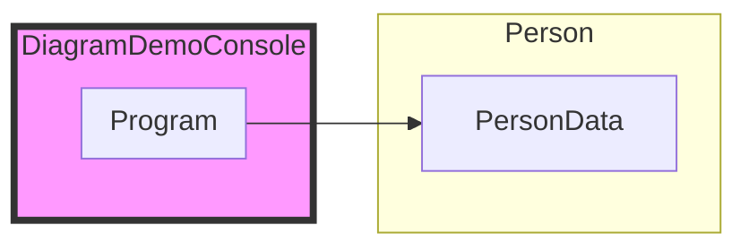
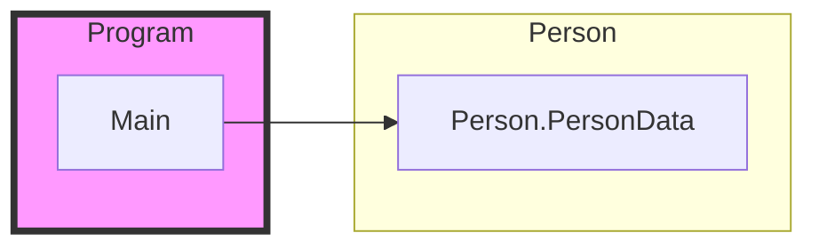

import Tabs from '@theme/Tabs';
import TabItem from '@theme/TabItem';
import TOCInline from '@theme/TOCInline';

# RSCG_ExportDiagram  by AndreiIgnat


<TOCInline toc={toc}  />

## NuGet / site data
[](https://github.com/ignatandrei/RSCG_ExportDiagram)
[](https://github.com/ignatandrei/RSCG_ExportDiagram)


## Details

### Info
:::info

Name: **RSCG_ExportDiagram**

Roslyn Diagram generator for external dependencies

Author: AndreiIgnat

NuGet: 
*https://github.com/ignatandrei/RSCG_ExportDiagram*   


You can find more details at RSCG_ExportDiagram

Source: https://github.com/ignatandrei/RSCG_ExportDiagram

:::

### Original Readme
:::note

# RSCG_ExportDiagram

export diagram for external relations for a csproj  with other csproj

## Install

Add to the csproj
    
```xml

<ItemGroup>
<PackageReference Include="RSCG_ExportDiagram" Version="2024.810.832" OutputItemType="Analyzer" ReferenceOutputAssembly="false"   />
</ItemGroup>
<ItemGroup>
	<CompilerVisibleProperty Include="RSCG_ExportDiagram_OutputFolder" />
	<CompilerVisibleProperty Include="RSCG_ExportDiagram_Exclude" />
</ItemGroup>	
<PropertyGroup>
<RSCG_ExportDiagram_OutputFolder>..</RSCG_ExportDiagram_OutputFolder>
<RSCG_ExportDiagram_Exclude></RSCG_ExportDiagram_Exclude>
</PropertyGroup>

```


    And the diagram will be generated in the folder parent for the .csproj file

Alternatively, you can use the command line tool to generate the diagram for a solution

```powershell

function ProcessCsproj {
  param (
      [string]$project,
      [string]$folderOutput
  )

$version = "2024.810.832"
#$folderOutput= ".."
$newNode = [xml]@"
<MainData>
<ItemGroup>
  <CompilerVisibleProperty Include="RSCG_ExportDiagram_OutputFolder" />
  <CompilerVisibleProperty Include="RSCG_ExportDiagram_Exclude" />
</ItemGroup>

<PropertyGroup>
  <RSCG_ExportDiagram_OutputFolder>$folderOutput</RSCG_ExportDiagram_OutputFolder>
  <RSCG_ExportDiagram_Exclude></RSCG_ExportDiagram_Exclude>
</PropertyGroup>
</MainData>
"@


# Write-Host $newNode.MainData.InnerXml
$backFile =$project + ".bak"
Copy-Item $project $backFile 
dotnet add $project package RSCG_ExportDiagram -v $version 

$proj = [xml](Get-Content $project)

$foundNode = $proj.Project
#Write-Host $proj.Project.InnerXml

$ItemGroup = $proj.ImportNode($newNode.DocumentElement.ItemGroup,$true)
$proj.Project.PrependChild($ItemGroup) 
$proj.DocumentElement.AppendChild($ItemGroup )


$PropertyGroup = $proj.ImportNode($newNode.DocumentElement.PropertyGroup,$true)
$proj.Project.PrependChild($PropertyGroup) 
$proj.DocumentElement.AppendChild($PropertyGroup)
$proj.Save($project) 
dotnet build
# pause
Copy-Item $backFile  $project -Force
Remove-Item $backFile  -Force

}

$solution  = gci *.sln | %{ $_.FullName}
$folderSolution = Split-Path $solution
# Write-Host $folderSolution
Get-Content $solution |
  Select-String 'Project\(' |
    ForEach-Object {
      $projectParts = $_ -Split '[,=]' | ForEach-Object { $_.Trim('[ "{}]') };
      # New-Object PSObject -Property @{
      #   Name = $projectParts[1];
      #   File = $projectParts[2];
      #   Guid = $projectParts[3]
      # }
      if ($projectParts[2] -match '.csproj$'){	
        $fileProject =Join-Path  $folderSolution $projectParts[2]
        Write-Host $fileProject
        ProcessCsproj -project $fileProject -folderOutput $folderSolution
      }
    }


```
    


:::

### About
:::note

Generating diagram for relation classes within referenced project 


:::

## How to use

### Example (source csproj, source files)

<Tabs>

<TabItem value="csproj" label="CSharp Project">

This is the CSharp Project that references **RSCG_ExportDiagram**
```xml showLineNumbers {11}
<Project Sdk="Microsoft.NET.Sdk">

  <PropertyGroup>
    <OutputType>Exe</OutputType>
    <TargetFramework>net8.0</TargetFramework>
    <ImplicitUsings>enable</ImplicitUsings>
    <Nullable>enable</Nullable>
  </PropertyGroup>

	<ItemGroup>
		<PackageReference Include="RSCG_ExportDiagram" Version="2024.810.832" OutputItemType="Analyzer" ReferenceOutputAssembly="false" />
	</ItemGroup>
	<ItemGroup>
		<CompilerVisibleProperty Include="RSCG_ExportDiagram_OutputFolder" />
		<CompilerVisibleProperty Include="RSCG_ExportDiagram_Exclude" />
	</ItemGroup>
	<ItemGroup>
	  <ProjectReference Include="..\Person\Person.csproj" />
	</ItemGroup>
	<PropertyGroup>
		<RSCG_ExportDiagram_OutputFolder>obj/GX/</RSCG_ExportDiagram_OutputFolder>
		<RSCG_ExportDiagram_Exclude></RSCG_ExportDiagram_Exclude>
	</PropertyGroup>
	<PropertyGroup>
		<EmitCompilerGeneratedFiles>true</EmitCompilerGeneratedFiles>
		<CompilerGeneratedFilesOutputPath>$(BaseIntermediateOutputPath)\GX</CompilerGeneratedFilesOutputPath>
	</PropertyGroup>
</Project>

```

</TabItem>

  <TabItem value="D:\gth\RSCG_Examples\v2\rscg_examples\RSCG_ExportDiagram\src\DiagramDemoConsole\Program.cs" label="Program.cs" >

  This is the use of **RSCG_ExportDiagram** in *Program.cs*

```csharp showLineNumbers 
using Person;

internal class Program
{
    private static void Main(string[] args)
    {
        PersonData person = new ();
        person.Name = "Andrei Ignat";
        Console.WriteLine(person.Name);
    }
}
```
  </TabItem>

  <TabItem value="D:\gth\RSCG_Examples\v2\rscg_examples\RSCG_ExportDiagram\src\Person\PersonData.cs" label="PersonData.cs" >

  This is the use of **RSCG_ExportDiagram** in *PersonData.cs*

```csharp showLineNumbers 
namespace Person;

public class PersonData
{
    public string Name { get; set; }
    public int Age { get; set; }
}


```
  </TabItem>

</Tabs>

### Generated Files

Those are taken from $(BaseIntermediateOutputPath)\GX

<Tabs>


<TabItem value="D:\gth\RSCG_Examples\v2\rscg_examples\RSCG_ExportDiagram\src\DiagramDemoConsole\obj\GX\RSCG_ExportDiagram\RSCG_ExportDiagram.GeneratorDiagram\DiagramDemoConsole_Program_1_gen.cs" label="DiagramDemoConsole_Program_1_gen.cs" >


```csharp showLineNumbers 

//JSONFolder=obj/GX/
//projectDir=D:\eu\GitHub\RSCG_Examples\v2\rscg_examples\RSCG_ExportDiagram\src\DiagramDemoConsole\
//projectName=DiagramDemoConsole
//excludeData=
file class Program_References_1
{
    public Program_References_1()
{
     

// Method Main has following external references
// Person.PersonData..ctor
//Person.PersonData.Name

}
}

```

  </TabItem>


<TabItem value="D:\gth\RSCG_Examples\v2\rscg_examples\RSCG_ExportDiagram\src\DiagramDemoConsole\obj\GX\DiagramDemoConsole_rel_csproj.md" label="DiagramDemoConsole_rel_csproj.md" >


# Classes of DiagramDemoConsole




## Class Program




  </TabItem>


</Tabs>

## Useful

### Download Example (.NET  C# )

:::tip

[Download Example project RSCG_ExportDiagram ](/sources/RSCG_ExportDiagram.zip)

:::


### Share RSCG_ExportDiagram 

<ul>
  <li><a href="https://www.facebook.com/sharer/sharer.php?u=https%3A%2F%2Fignatandrei.github.io%2FRSCG_Examples%2Fv2%2Fdocs%2FRSCG_ExportDiagram&quote=RSCG_ExportDiagram" title="Share on Facebook" target="_blank">Share on Facebook</a></li>
  <li><a href="https://twitter.com/intent/tweet?source=https%3A%2F%2Fignatandrei.github.io%2FRSCG_Examples%2Fv2%2Fdocs%2FRSCG_ExportDiagram&text=RSCG_ExportDiagram:%20https%3A%2F%2Fignatandrei.github.io%2FRSCG_Examples%2Fv2%2Fdocs%2FRSCG_ExportDiagram" target="_blank" title="Tweet">Share in Twitter</a></li>
  <li><a href="http://www.reddit.com/submit?url=https%3A%2F%2Fignatandrei.github.io%2FRSCG_Examples%2Fv2%2Fdocs%2FRSCG_ExportDiagram&title=RSCG_ExportDiagram" target="_blank" title="Submit to Reddit">Share on Reddit</a></li>
  <li><a href="http://www.linkedin.com/shareArticle?mini=true&url=https%3A%2F%2Fignatandrei.github.io%2FRSCG_Examples%2Fv2%2Fdocs%2FRSCG_ExportDiagram&title=RSCG_ExportDiagram&summary=&source=https%3A%2F%2Fignatandrei.github.io%2FRSCG_Examples%2Fv2%2Fdocs%2FRSCG_ExportDiagram" target="_blank" title="Share on LinkedIn">Share on Linkedin</a></li>
</ul>

https://ignatandrei.github.io/RSCG_Examples/v2/docs/RSCG_ExportDiagram

### In the same category (EnhancementProject) - 17 other generators


#### [AutoInvoke.Generator](/docs/AutoInvoke.Generator)


#### [AutoSpectre](/docs/AutoSpectre)


#### [BuildInfo](/docs/BuildInfo)


#### [CommandLine](/docs/CommandLine)


#### [Credfeto.Version.Information.Generator](/docs/Credfeto.Version.Information.Generator)


#### [Larcanum.GitInfo](/docs/Larcanum.GitInfo)


#### [LinqGen.Generator](/docs/LinqGen.Generator)


#### [Pekspro.BuildInformationGenerator](/docs/Pekspro.BuildInformationGenerator)


#### [PlantUmlClassDiagramGenerator](/docs/PlantUmlClassDiagramGenerator)


#### [RSCG_AMS](/docs/RSCG_AMS)


#### [RSCG_FunctionsWithDI](/docs/RSCG_FunctionsWithDI)


#### [RSCG_NameGenerator](/docs/RSCG_NameGenerator)


#### [RSCG_TimeBombComment](/docs/RSCG_TimeBombComment)


#### [RSCG_Wait](/docs/RSCG_Wait)


#### [ThisAssembly](/docs/ThisAssembly)


#### [ThisAssembly.Constants](/docs/ThisAssembly.Constants)


#### [ThisAssembly.Metadata](/docs/ThisAssembly.Metadata)

