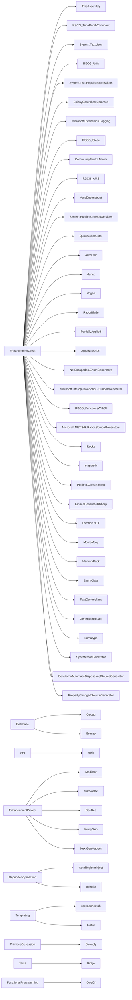

import DocCardList from '@theme/DocCardList';

[See time based list](/docs/List-of-RSCG)

```mermaid 
flowchart LR;

    EnhancementClass--> ThisAssembly
    EnhancementClass--> RSCG_TimeBombComment
    EnhancementClass--> System.Text.Json
    EnhancementClass--> RSCG_Utils
    EnhancementClass--> System.Text.RegularExpressions
    EnhancementClass--> SkinnyControllersCommon
    EnhancementClass--> Microsoft.Extensions.Logging
    EnhancementClass--> RSCG_Static
    EnhancementClass--> CommunityToolkit.Mvvm
    EnhancementClass--> RSCG_AMS
    EnhancementClass--> AutoDeconstruct
    EnhancementClass--> System.Runtime.InteropServices
    EnhancementClass--> QuickConstructor
    EnhancementClass--> AutoCtor
    EnhancementClass--> dunet
    EnhancementClass--> Vogen
    EnhancementClass--> RazorBlade
    EnhancementClass--> PartiallyApplied
    EnhancementClass--> ApparatusAOT
    EnhancementClass--> NetEscapades.EnumGenerators
    EnhancementClass--> Microsoft.Interop.JavaScript.JSImportGenerator
    EnhancementClass--> RSCG_FunctionsWithDI
    EnhancementClass--> Microsoft.NET.Sdk.Razor.SourceGenerators
    EnhancementClass--> Rocks
    EnhancementClass--> mapperly
    EnhancementClass--> Podimo.ConstEmbed
    EnhancementClass--> EmbedResourceCSharp
    EnhancementClass--> Lombok.NET
    Database--> Gedaq
    API--> Refit
    EnhancementClass--> MorrisMoxy
    EnhancementProject--> Mediator
    EnhancementProject--> Matryoshki
    EnhancementClass--> MemoryPack
    EnhancementProject--> DeeDee
    EnhancementProject--> ProxyGen
    DependencyInjection--> AutoRegisterInject
    EnhancementClass--> EnumClass
    Database--> Breezy
    EnhancementClass--> FastGenericNew
    EnhancementClass--> GeneratorEquals
    EnhancementClass--> Immutype
    Templating--> spreadcheetah
    EnhancementClass--> SyncMethodGenerator
    EnhancementClass--> BenutomoAutomaticDisposeImplSourceGenerator
    EnhancementProject--> NextGenMapper
    DependencyInjection--> Injectio
    EnhancementClass--> PropertyChangedSourceGenerator
    PrimitiveObsession--> Strongly
    Tests--> Ridge
    FunctionalProgramming--> OneOf
    Templating--> Gobie
   
```

<DocCardList />