import DocCardList from '@theme/DocCardList';

[See time based list](/docs/List-of-RSCG)

## Actor 

    
  
Expand Actor =>examples:1

        

[ActorSrcGen](/docs/ActorSrcGen)

    

## AI 

    
  
Expand AI =>examples:1

        

[SKPromptGenerator](/docs/SKPromptGenerator)

    

## AOP 

    
  
Expand AOP =>examples:1

        

[WhatIAmDoing](/docs/WhatIAmDoing)

    

## API 

    
  
Expand API =>examples:10

        

[SkinnyControllersCommon](/docs/SkinnyControllersCommon)

        

[Refit](/docs/Refit)

        

[RSCG_WebAPIExports](/docs/RSCG_WebAPIExports)

        

[SafeRouting](/docs/SafeRouting)

        

[MinimalApiBuilder](/docs/MinimalApiBuilder)

        

[Microsoft.Extensions.Configuration.Binder](/docs/Microsoft.Extensions.Configuration.Binder)

        

[RDG](/docs/RDG)

        

[MinimalApis.Discovery](/docs/MinimalApis.Discovery)

        

[MinimalHelpers.Routing.Analyzers](/docs/MinimalHelpers.Routing.Analyzers)

        

[immediate.apis](/docs/immediate.apis)

    

## Async 

    
  
Expand Async =>examples:2

        

[HsuSgSync](/docs/HsuSgSync)

        

[AsyncIt](/docs/AsyncIt)

    

## Bitwise 

    
  
Expand Bitwise =>examples:2

        

[BitsKit](/docs/BitsKit)

        

[Darp.BinaryObjects](/docs/Darp.BinaryObjects)

    

## Blazor 

    
  
Expand Blazor =>examples:4

        

[Blazorators](/docs/Blazorators)

        

[GoLive.Generator.BlazorInterop](/docs/GoLive.Generator.BlazorInterop)

        

[Blazor.TSRuntime](/docs/Blazor.TSRuntime)

        

[BadIdeas.Icons.FontAwesome](/docs/BadIdeas.Icons.FontAwesome)

    

## Builder 

    
  
Expand Builder =>examples:7

        

[BuilderGenerator](/docs/BuilderGenerator)

        

[Architect.DomainModeling](/docs/Architect.DomainModeling)

        

[Fluentify](/docs/Fluentify)

        

[Hsu.Sg.FluentMember](/docs/Hsu.Sg.FluentMember)

        

[StepwiseBuilderGenerator](/docs/StepwiseBuilderGenerator)

        

[DimonSmart.BuilderGenerator](/docs/DimonSmart.BuilderGenerator)

        

[ShadowWriterBuilder](/docs/ShadowWriterBuilder)

    

## Clone 

    
  
Expand Clone =>examples:3

        

[CopyTo](/docs/CopyTo)

        

[Dolly](/docs/Dolly)

        

[UtilityVerse.Copy](/docs/UtilityVerse.Copy)

    

## CodeToString 

    
  
Expand CodeToString =>examples:3

        

[SourceGenerator.Helper.CopyCode](/docs/SourceGenerator.Helper.CopyCode)

        

[CodeAnalysis](/docs/CodeAnalysis)

        

[RossLean.StringificationGenerator](/docs/RossLean.StringificationGenerator)

    

## CommandLine 

    
  
Expand CommandLine =>examples:1

        

[ArgumentParsing](/docs/ArgumentParsing)

    

## Console 

    
  
Expand Console =>examples:2

        

[Figgle](/docs/Figgle)

        

[ConsoleAppFramework](/docs/ConsoleAppFramework)

    

## Constructor 

    
  
Expand Constructor =>examples:7

        

[AutoDeconstruct](/docs/AutoDeconstruct)

        

[QuickConstructor](/docs/QuickConstructor)

        

[AutoCtor](/docs/AutoCtor)

        

[AutoConstructor](/docs/AutoConstructor)

        

[PrimaryParameter](/docs/PrimaryParameter)

        

[sourcedepend](/docs/sourcedepend)

        

[ConstructorGenerator](/docs/ConstructorGenerator)

    

## Database 

    
  
Expand Database =>examples:7

        

[Gedaq](/docs/Gedaq)

        

[Breezy](/docs/Breezy)

        

[TableStorage](/docs/TableStorage)

        

[Dapper.AOT](/docs/Dapper.AOT)

        

[EntityLengths.Generator](/docs/EntityLengths.Generator)

        

[Finch.Generators](/docs/Finch.Generators)

        

[Unflat](/docs/Unflat)

    

## DependencyInjection 

    
  
Expand DependencyInjection =>examples:10

        

[AutoRegisterInject](/docs/AutoRegisterInject)

        

[Injectio](/docs/Injectio)

        

[jab](/docs/jab)

        

[FactoryGenerator](/docs/FactoryGenerator)

        

[depso](/docs/depso)

        

[ServiceScan.SourceGenerator](/docs/ServiceScan.SourceGenerator)

        

[Pure.DI](/docs/Pure.DI)

        

[DependencyModules.SourceGenerator](/docs/DependencyModules.SourceGenerator)

        

[BunnyTailServiceRegistration](/docs/BunnyTailServiceRegistration)

        

[FactoryGenerator.Abstractions](/docs/FactoryGenerator.Abstractions)

    

## Disposer 

    
  
Expand Disposer =>examples:5

        

[BenutomoAutomaticDisposeImplSourceGenerator](/docs/BenutomoAutomaticDisposeImplSourceGenerator)

        

[Disposer](/docs/Disposer)

        

[DisposableHelpers](/docs/DisposableHelpers)

        

[IDisposableGenerator](/docs/IDisposableGenerator)

        

[Coplt.Dropping](/docs/Coplt.Dropping)

    

## EnhancementClass 

    
  
Expand EnhancementClass =>examples:27

        

[System.Text.RegularExpressions](/docs/System.Text.RegularExpressions)

        

[Microsoft.Extensions.Logging](/docs/Microsoft.Extensions.Logging)

        

[System.Runtime.InteropServices](/docs/System.Runtime.InteropServices)

        

[ApparatusAOT](/docs/ApparatusAOT)

        

[Microsoft.Interop.JavaScript.JSImportGenerator](/docs/Microsoft.Interop.JavaScript.JSImportGenerator)

        

[Lombok.NET](/docs/Lombok.NET)

        

[MemoryPack](/docs/MemoryPack)

        

[FastGenericNew](/docs/FastGenericNew)

        

[Immutype](/docs/Immutype)

        

[SyncMethodGenerator](/docs/SyncMethodGenerator)

        

[M31.FluentAPI](/docs/M31.FluentAPI)

        

[RSCG_Decorator](/docs/RSCG_Decorator)

        

[Meziantou.Polyfill](/docs/Meziantou.Polyfill)

        

[StaticReflection](/docs/StaticReflection)

        

[DudNet](/docs/DudNet)

        

[Microsoft.Extensions.Options.Generators.OptionsValidatorGenerator](/docs/Microsoft.Extensions.Options.Generators.OptionsValidatorGenerator)

        

[TelemetryLogging](/docs/TelemetryLogging)

        

[Ling.Audit](/docs/Ling.Audit)

        

[RSCG_UtilityTypes](/docs/RSCG_UtilityTypes)

        

[AspectGenerator](/docs/AspectGenerator)

        

[OptionToStringGenerator](/docs/OptionToStringGenerator)

        

[CommonCodeGenerator](/docs/CommonCodeGenerator)

        

[ThisClass](/docs/ThisClass)

        

[Enhanced.GetTypes](/docs/Enhanced.GetTypes)

        

[QueryStringGenerator](/docs/QueryStringGenerator)

        

[MemberAccessor](/docs/MemberAccessor)

        

[Comparison](/docs/Comparison)

    

## EnhancementProject 

    
  
Expand EnhancementProject =>examples:20

        

[ThisAssembly](/docs/ThisAssembly)

        

[RSCG_TimeBombComment](/docs/RSCG_TimeBombComment)

        

[RSCG_AMS](/docs/RSCG_AMS)

        

[RSCG_FunctionsWithDI](/docs/RSCG_FunctionsWithDI)

        

[BuildInfo](/docs/BuildInfo)

        

[CommandLine](/docs/CommandLine)

        

[PlantUmlClassDiagramGenerator](/docs/PlantUmlClassDiagramGenerator)

        

[RSCG_Wait](/docs/RSCG_Wait)

        

[AutoSpectre](/docs/AutoSpectre)

        

[AutoInvoke.Generator](/docs/AutoInvoke.Generator)

        

[LinqGen.Generator](/docs/LinqGen.Generator)

        

[ThisAssembly.Constants](/docs/ThisAssembly.Constants)

        

[Pekspro.BuildInformationGenerator](/docs/Pekspro.BuildInformationGenerator)

        

[ThisAssembly.Metadata](/docs/ThisAssembly.Metadata)

        

[RSCG_ExportDiagram](/docs/RSCG_ExportDiagram)

        

[RSCG_NameGenerator](/docs/RSCG_NameGenerator)

        

[Credfeto.Version.Information.Generator](/docs/Credfeto.Version.Information.Generator)

        

[Larcanum.GitInfo](/docs/Larcanum.GitInfo)

        

[ShadowWriterProjectInfo](/docs/ShadowWriterProjectInfo)

        

[AssemblyVersionInfo](/docs/AssemblyVersionInfo)

    

## Enum 

    
  
Expand Enum =>examples:12

        

[NetEscapades.EnumGenerators](/docs/NetEscapades.EnumGenerators)

        

[EnumClass](/docs/EnumClass)

        

[CredFetoEnum](/docs/CredFetoEnum)

        

[EnumUtilities](/docs/EnumUtilities)

        

[FusionReactor](/docs/FusionReactor)

        

[PMart.Enumeration](/docs/PMart.Enumeration)

        

[jos.enumeration](/docs/jos.enumeration)

        

[Flaggen](/docs/Flaggen)

        

[Genbox.FastEnum](/docs/Genbox.FastEnum)

        

[EnumsEnhanced](/docs/EnumsEnhanced)

        

[requiredenum](/docs/requiredenum)

        

[RapidEnum](/docs/RapidEnum)

    

## Equals 

    
  
Expand Equals =>examples:3

        

[GeneratorEquals](/docs/GeneratorEquals)

        

[Equatable.Generator](/docs/Equatable.Generator)

        

[Valuify](/docs/Valuify)

    

## FilesToCode 

    
  
Expand FilesToCode =>examples:17

        

[RSCG_Utils](/docs/RSCG_Utils)

        

[Podimo.ConstEmbed](/docs/Podimo.ConstEmbed)

        

[EmbedResourceCSharp](/docs/EmbedResourceCSharp)

        

[ThisAssembly_Resources](/docs/ThisAssembly_Resources)

        

[ResXGenerator](/docs/ResXGenerator)

        

[Chorn.EmbeddedResourceAccessGenerator](/docs/Chorn.EmbeddedResourceAccessGenerator)

        

[NotNotAppSettings](/docs/NotNotAppSettings)

        

[Weave](/docs/Weave)

        

[corecraft](/docs/corecraft)

        

[LingoGen](/docs/LingoGen)

        

[RSCG_JSON2Class](/docs/RSCG_JSON2Class)

        

[DotnetYang](/docs/DotnetYang)

        

[ThisAssembly.Strings](/docs/ThisAssembly.Strings)

        

[Datacute.EmbeddedResourcePropertyGenerator](/docs/Datacute.EmbeddedResourcePropertyGenerator)

        

[Strings.ResourceGenerator](/docs/Strings.ResourceGenerator)

        

[NFH.FileEmbed](/docs/NFH.FileEmbed)

        

[kli.Localize](/docs/kli.Localize)

    

## FunctionalProgramming 

    
  
Expand FunctionalProgramming =>examples:16

        

[dunet](/docs/dunet)

        

[PartiallyApplied](/docs/PartiallyApplied)

        

[OneOf](/docs/OneOf)

        

[RSCG_Utils_Memo](/docs/RSCG_Utils_Memo)

        

[N.SourceGenerators.UnionTypes](/docs/N.SourceGenerators.UnionTypes)

        

[Funcky.DiscriminatedUnion](/docs/Funcky.DiscriminatedUnion)

        

[FunicularSwitch](/docs/FunicularSwitch)

        

[cachesourcegenerator](/docs/cachesourcegenerator)

        

[UnionsGenerator](/docs/UnionsGenerator)

        

[TypeUtilities](/docs/TypeUtilities)

        

[UnionGen](/docs/UnionGen)

        

[Sera.Union](/docs/Sera.Union)

        

[Dusharp](/docs/Dusharp)

        

[rscg_queryables](/docs/rscg_queryables)

        

[polytype](/docs/polytype)

        

[rscg_demeter](/docs/rscg_demeter)

    

## Hangfire 

    
  
Expand Hangfire =>examples:1

        

[HangfireRecurringJob](/docs/HangfireRecurringJob)

    

## Interface 

    
  
Expand Interface =>examples:14

        

[RSCG_Static](/docs/RSCG_Static)

        

[Matryoshki](/docs/Matryoshki)

        

[ProxyGen](/docs/ProxyGen)

        

[Roozie.AutoInterface](/docs/Roozie.AutoInterface)

        

[Biwen.AutoClassGen](/docs/Biwen.AutoClassGen)

        

[CopyCat](/docs/CopyCat)

        

[MakeInterface.Generator](/docs/MakeInterface.Generator)

        

[NetAutomaticInterface](/docs/NetAutomaticInterface)

        

[Farskeptic.AutoCompose](/docs/Farskeptic.AutoCompose)

        

[Minerals.AutoInterfaces](/docs/Minerals.AutoInterfaces)

        

[rscg_Interface_to_null_object](/docs/rscg_Interface_to_null_object)

        

[RSCG_CompositeProvider](/docs/RSCG_CompositeProvider)

        

[AutoInterface](/docs/AutoInterface)

        

[ShadowWriterNullobjects](/docs/ShadowWriterNullobjects)

    

## Linq 

    
  
Expand Linq =>examples:1

        

[zlinq](/docs/zlinq)

    

## Mapper 

    
  
Expand Mapper =>examples:9

        

[mapperly](/docs/mapperly)

        

[NextGenMapper](/docs/NextGenMapper)

        

[AutoDTO](/docs/AutoDTO)

        

[MapTo](/docs/MapTo)

        

[MagicMap](/docs/MagicMap)

        

[DynamicsMapper](/docs/DynamicsMapper)

        

[AutoGen](/docs/AutoGen)

        

[LightweightObjectMapper](/docs/LightweightObjectMapper)

        

[Facet](/docs/Facet)

    

## Mediator 

    
  
Expand Mediator =>examples:3

        

[Mediator](/docs/Mediator)

        

[DeeDee](/docs/DeeDee)

        

[Immediate.Handlers](/docs/Immediate.Handlers)

    

## Mixin 

    
  
Expand Mixin =>examples:3

        

[MorrisMoxy](/docs/MorrisMoxy)

        

[Minerals.AutoMixins](/docs/Minerals.AutoMixins)

        

[JinShil.MixinSourceGenerator](/docs/JinShil.MixinSourceGenerator)

    

## MVC 

    
  
Expand MVC =>examples:1

        

[SG4MVC](/docs/SG4MVC)

    

## MVVM 

    
  
Expand MVVM =>examples:3

        

[CommunityToolkit.Mvvm](/docs/CommunityToolkit.Mvvm)

        

[PropertyChangedSourceGenerator](/docs/PropertyChangedSourceGenerator)

        

[mvvmgen](/docs/mvvmgen)

    

## Optimizer 

    
  
Expand Optimizer =>examples:1

        

[StringLiteral](/docs/StringLiteral)

    

## PrimitiveObsession 

    
  
Expand PrimitiveObsession =>examples:5

        

[Vogen](/docs/Vogen)

        

[Strongly](/docs/Strongly)

        

[UnitGenerator](/docs/UnitGenerator)

        

[DomainPrimitives](/docs/DomainPrimitives)

        

[StronglyTypedUid](/docs/StronglyTypedUid)

    

## RX 

    
  
Expand RX =>examples:1

        

[RxSourceGenerator](/docs/RxSourceGenerator)

    

## Serializer 

    
  
Expand Serializer =>examples:9

        

[System.Text.Json](/docs/System.Text.Json)

        

[ProtobufSourceGenerator](/docs/ProtobufSourceGenerator)

        

[JsonPolymorphicGenerator](/docs/JsonPolymorphicGenerator)

        

[jsonConverterSourceGenerator](/docs/jsonConverterSourceGenerator)

        

[GenPack](/docs/GenPack)

        

[StackXML](/docs/StackXML)

        

[Nino](/docs/Nino)

        

[Schema](/docs/Schema)

        

[VYaml](/docs/VYaml)

    

## SignalR 

    
  
Expand SignalR =>examples:1

        

[TypedSignalR.Client](/docs/TypedSignalR.Client)

    

## StateMachine 

    
  
Expand StateMachine =>examples:1

        

[SuperFluid](/docs/SuperFluid)

    

## Templating 

    
  
Expand Templating =>examples:12

        

[RazorBlade](/docs/RazorBlade)

        

[Microsoft.NET.Sdk.Razor.SourceGenerators](/docs/Microsoft.NET.Sdk.Razor.SourceGenerators)

        

[spreadcheetah](/docs/spreadcheetah)

        

[Gobie](/docs/Gobie)

        

[RSCG_Templating](/docs/RSCG_Templating)

        

[InterceptorTemplate](/docs/InterceptorTemplate)

        

[RSCG_IFormattable](/docs/RSCG_IFormattable)

        

[JKToolKit.TemplatePropertyGenerator](/docs/JKToolKit.TemplatePropertyGenerator)

        

[RazorSlices](/docs/RazorSlices)

        

[NTypewriter](/docs/NTypewriter)

        

[Tortuga.Shipwright](/docs/Tortuga.Shipwright)

        

[InlineComposition](/docs/InlineComposition)

    

## Tests 

    
  
Expand Tests =>examples:5

        

[Rocks](/docs/Rocks)

        

[Ridge](/docs/Ridge)

        

[mocklis](/docs/mocklis)

        

[MSTest](/docs/MSTest)

        

[MockMe](/docs/MockMe)

    

## WinAPI 

    
  
Expand WinAPI =>examples:3

        

[Com](/docs/Com)

        

[Microsoft.Windows.CsWin32](/docs/Microsoft.Windows.CsWin32)

        

[NativeObjects](/docs/NativeObjects)

```mermaid 
flowchart LR;


    Actor--> ActorSrcGen((ActorSrcGen))

    AI--> SKPromptGenerator((SKPromptGenerator))

    AOP--> WhatIAmDoing((WhatIAmDoing))

    API--> SkinnyControllersCommon((SkinnyControllersCommon))

    API--> Refit((Refit))

    API--> RSCG_WebAPIExports((RSCG_WebAPIExports))

    API--> SafeRouting((SafeRouting))

    API--> MinimalApiBuilder((MinimalApiBuilder))

    API--> Microsoft.Extensions.Configuration.Binder((Microsoft.Extensions.Configuration.Binder))

    API--> RDG((RDG))

    API--> MinimalApis.Discovery((MinimalApis.Discovery))

    API--> MinimalHelpers.Routing.Analyzers((MinimalHelpers.Routing.Analyzers))

    API--> immediate.apis((immediate.apis))

    Async--> HsuSgSync((HsuSgSync))

    Async--> AsyncIt((AsyncIt))

    Bitwise--> BitsKit((BitsKit))

    Bitwise--> Darp.BinaryObjects((Darp.BinaryObjects))

    Blazor--> Blazorators((Blazorators))

    Blazor--> GoLive.Generator.BlazorInterop((GoLive.Generator.BlazorInterop))

    Blazor--> Blazor.TSRuntime((Blazor.TSRuntime))

    Blazor--> BadIdeas.Icons.FontAwesome((BadIdeas.Icons.FontAwesome))

    Builder--> BuilderGenerator((BuilderGenerator))

    Builder--> Architect.DomainModeling((Architect.DomainModeling))

    Builder--> Fluentify((Fluentify))

    Builder--> Hsu.Sg.FluentMember((Hsu.Sg.FluentMember))

    Builder--> StepwiseBuilderGenerator((StepwiseBuilderGenerator))

    Builder--> DimonSmart.BuilderGenerator((DimonSmart.BuilderGenerator))

    Builder--> ShadowWriterBuilder((ShadowWriterBuilder))

    Clone--> CopyTo((CopyTo))

    Clone--> Dolly((Dolly))

    Clone--> UtilityVerse.Copy((UtilityVerse.Copy))

    CodeToString--> SourceGenerator.Helper.CopyCode((SourceGenerator.Helper.CopyCode))

    CodeToString--> CodeAnalysis((CodeAnalysis))

    CodeToString--> RossLean.StringificationGenerator((RossLean.StringificationGenerator))

    CommandLine--> ArgumentParsing((ArgumentParsing))

    Console--> Figgle((Figgle))

    Console--> ConsoleAppFramework((ConsoleAppFramework))

    Constructor--> AutoDeconstruct((AutoDeconstruct))

    Constructor--> QuickConstructor((QuickConstructor))

    Constructor--> AutoCtor((AutoCtor))

    Constructor--> AutoConstructor((AutoConstructor))

    Constructor--> PrimaryParameter((PrimaryParameter))

    Constructor--> sourcedepend((sourcedepend))

    Constructor--> ConstructorGenerator((ConstructorGenerator))

    Database--> Gedaq((Gedaq))

    Database--> Breezy((Breezy))

    Database--> TableStorage((TableStorage))

    Database--> Dapper.AOT((Dapper.AOT))

    Database--> EntityLengths.Generator((EntityLengths.Generator))

    Database--> Finch.Generators((Finch.Generators))

    Database--> Unflat((Unflat))

    DependencyInjection--> AutoRegisterInject((AutoRegisterInject))

    DependencyInjection--> Injectio((Injectio))

    DependencyInjection--> jab((jab))

    DependencyInjection--> FactoryGenerator((FactoryGenerator))

    DependencyInjection--> depso((depso))

    DependencyInjection--> ServiceScan.SourceGenerator((ServiceScan.SourceGenerator))

    DependencyInjection--> Pure.DI((Pure.DI))

    DependencyInjection--> DependencyModules.SourceGenerator((DependencyModules.SourceGenerator))

    DependencyInjection--> BunnyTailServiceRegistration((BunnyTailServiceRegistration))

    DependencyInjection--> FactoryGenerator.Abstractions((FactoryGenerator.Abstractions))

    Disposer--> BenutomoAutomaticDisposeImplSourceGenerator((BenutomoAutomaticDisposeImplSourceGenerator))

    Disposer--> Disposer((Disposer))

    Disposer--> DisposableHelpers((DisposableHelpers))

    Disposer--> IDisposableGenerator((IDisposableGenerator))

    Disposer--> Coplt.Dropping((Coplt.Dropping))

    EnhancementClass--> System.Text.RegularExpressions((System.Text.RegularExpressions))

    EnhancementClass--> Microsoft.Extensions.Logging((Microsoft.Extensions.Logging))

    EnhancementClass--> System.Runtime.InteropServices((System.Runtime.InteropServices))

    EnhancementClass--> ApparatusAOT((ApparatusAOT))

    EnhancementClass--> Microsoft.Interop.JavaScript.JSImportGenerator((Microsoft.Interop.JavaScript.JSImportGenerator))

    EnhancementClass--> Lombok.NET((Lombok.NET))

    EnhancementClass--> MemoryPack((MemoryPack))

    EnhancementClass--> FastGenericNew((FastGenericNew))

    EnhancementClass--> Immutype((Immutype))

    EnhancementClass--> SyncMethodGenerator((SyncMethodGenerator))

    EnhancementClass--> M31.FluentAPI((M31.FluentAPI))

    EnhancementClass--> RSCG_Decorator((RSCG_Decorator))

    EnhancementClass--> Meziantou.Polyfill((Meziantou.Polyfill))

    EnhancementClass--> StaticReflection((StaticReflection))

    EnhancementClass--> DudNet((DudNet))

    EnhancementClass--> Microsoft.Extensions.Options.Generators.OptionsValidatorGenerator((Microsoft.Extensions.Options.Generators.OptionsValidatorGenerator))

    EnhancementClass--> TelemetryLogging((TelemetryLogging))

    EnhancementClass--> Ling.Audit((Ling.Audit))

    EnhancementClass--> RSCG_UtilityTypes((RSCG_UtilityTypes))

    EnhancementClass--> AspectGenerator((AspectGenerator))

    EnhancementClass--> OptionToStringGenerator((OptionToStringGenerator))

    EnhancementClass--> CommonCodeGenerator((CommonCodeGenerator))

    EnhancementClass--> ThisClass((ThisClass))

    EnhancementClass--> Enhanced.GetTypes((Enhanced.GetTypes))

    EnhancementClass--> QueryStringGenerator((QueryStringGenerator))

    EnhancementClass--> MemberAccessor((MemberAccessor))

    EnhancementClass--> Comparison((Comparison))

    EnhancementProject--> ThisAssembly((ThisAssembly))

    EnhancementProject--> RSCG_TimeBombComment((RSCG_TimeBombComment))

    EnhancementProject--> RSCG_AMS((RSCG_AMS))

    EnhancementProject--> RSCG_FunctionsWithDI((RSCG_FunctionsWithDI))

    EnhancementProject--> BuildInfo((BuildInfo))

    EnhancementProject--> CommandLine((CommandLine))

    EnhancementProject--> PlantUmlClassDiagramGenerator((PlantUmlClassDiagramGenerator))

    EnhancementProject--> RSCG_Wait((RSCG_Wait))

    EnhancementProject--> AutoSpectre((AutoSpectre))

    EnhancementProject--> AutoInvoke.Generator((AutoInvoke.Generator))

    EnhancementProject--> LinqGen.Generator((LinqGen.Generator))

    EnhancementProject--> ThisAssembly.Constants((ThisAssembly.Constants))

    EnhancementProject--> Pekspro.BuildInformationGenerator((Pekspro.BuildInformationGenerator))

    EnhancementProject--> ThisAssembly.Metadata((ThisAssembly.Metadata))

    EnhancementProject--> RSCG_ExportDiagram((RSCG_ExportDiagram))

    EnhancementProject--> RSCG_NameGenerator((RSCG_NameGenerator))

    EnhancementProject--> Credfeto.Version.Information.Generator((Credfeto.Version.Information.Generator))

    EnhancementProject--> Larcanum.GitInfo((Larcanum.GitInfo))

    EnhancementProject--> ShadowWriterProjectInfo((ShadowWriterProjectInfo))

    EnhancementProject--> AssemblyVersionInfo((AssemblyVersionInfo))

    Enum--> NetEscapades.EnumGenerators((NetEscapades.EnumGenerators))

    Enum--> EnumClass((EnumClass))

    Enum--> CredFetoEnum((CredFetoEnum))

    Enum--> EnumUtilities((EnumUtilities))

    Enum--> FusionReactor((FusionReactor))

    Enum--> PMart.Enumeration((PMart.Enumeration))

    Enum--> jos.enumeration((jos.enumeration))

    Enum--> Flaggen((Flaggen))

    Enum--> Genbox.FastEnum((Genbox.FastEnum))

    Enum--> EnumsEnhanced((EnumsEnhanced))

    Enum--> requiredenum((requiredenum))

    Enum--> RapidEnum((RapidEnum))

    Equals--> GeneratorEquals((GeneratorEquals))

    Equals--> Equatable.Generator((Equatable.Generator))

    Equals--> Valuify((Valuify))

    FilesToCode--> RSCG_Utils((RSCG_Utils))

    FilesToCode--> Podimo.ConstEmbed((Podimo.ConstEmbed))

    FilesToCode--> EmbedResourceCSharp((EmbedResourceCSharp))

    FilesToCode--> ThisAssembly_Resources((ThisAssembly_Resources))

    FilesToCode--> ResXGenerator((ResXGenerator))

    FilesToCode--> Chorn.EmbeddedResourceAccessGenerator((Chorn.EmbeddedResourceAccessGenerator))

    FilesToCode--> NotNotAppSettings((NotNotAppSettings))

    FilesToCode--> Weave((Weave))

    FilesToCode--> corecraft((corecraft))

    FilesToCode--> LingoGen((LingoGen))

    FilesToCode--> RSCG_JSON2Class((RSCG_JSON2Class))

    FilesToCode--> DotnetYang((DotnetYang))

    FilesToCode--> ThisAssembly.Strings((ThisAssembly.Strings))

    FilesToCode--> Datacute.EmbeddedResourcePropertyGenerator((Datacute.EmbeddedResourcePropertyGenerator))

    FilesToCode--> Strings.ResourceGenerator((Strings.ResourceGenerator))

    FilesToCode--> NFH.FileEmbed((NFH.FileEmbed))

    FilesToCode--> kli.Localize((kli.Localize))

    FunctionalProgramming--> dunet((dunet))

    FunctionalProgramming--> PartiallyApplied((PartiallyApplied))

    FunctionalProgramming--> OneOf((OneOf))

    FunctionalProgramming--> RSCG_Utils_Memo((RSCG_Utils_Memo))

    FunctionalProgramming--> N.SourceGenerators.UnionTypes((N.SourceGenerators.UnionTypes))

    FunctionalProgramming--> Funcky.DiscriminatedUnion((Funcky.DiscriminatedUnion))

    FunctionalProgramming--> FunicularSwitch((FunicularSwitch))

    FunctionalProgramming--> cachesourcegenerator((cachesourcegenerator))

    FunctionalProgramming--> UnionsGenerator((UnionsGenerator))

    FunctionalProgramming--> TypeUtilities((TypeUtilities))

    FunctionalProgramming--> UnionGen((UnionGen))

    FunctionalProgramming--> Sera.Union((Sera.Union))

    FunctionalProgramming--> Dusharp((Dusharp))

    FunctionalProgramming--> rscg_queryables((rscg_queryables))

    FunctionalProgramming--> polytype((polytype))

    FunctionalProgramming--> rscg_demeter((rscg_demeter))

    Hangfire--> HangfireRecurringJob((HangfireRecurringJob))

    Interface--> RSCG_Static((RSCG_Static))

    Interface--> Matryoshki((Matryoshki))

    Interface--> ProxyGen((ProxyGen))

    Interface--> Roozie.AutoInterface((Roozie.AutoInterface))

    Interface--> Biwen.AutoClassGen((Biwen.AutoClassGen))

    Interface--> CopyCat((CopyCat))

    Interface--> MakeInterface.Generator((MakeInterface.Generator))

    Interface--> NetAutomaticInterface((NetAutomaticInterface))

    Interface--> Farskeptic.AutoCompose((Farskeptic.AutoCompose))

    Interface--> Minerals.AutoInterfaces((Minerals.AutoInterfaces))

    Interface--> rscg_Interface_to_null_object((rscg_Interface_to_null_object))

    Interface--> RSCG_CompositeProvider((RSCG_CompositeProvider))

    Interface--> AutoInterface((AutoInterface))

    Interface--> ShadowWriterNullobjects((ShadowWriterNullobjects))

    Linq--> zlinq((zlinq))

    Mapper--> mapperly((mapperly))

    Mapper--> NextGenMapper((NextGenMapper))

    Mapper--> AutoDTO((AutoDTO))

    Mapper--> MapTo((MapTo))

    Mapper--> MagicMap((MagicMap))

    Mapper--> DynamicsMapper((DynamicsMapper))

    Mapper--> AutoGen((AutoGen))

    Mapper--> LightweightObjectMapper((LightweightObjectMapper))

    Mapper--> Facet((Facet))

    Mediator--> Mediator((Mediator))

    Mediator--> DeeDee((DeeDee))

    Mediator--> Immediate.Handlers((Immediate.Handlers))

    Mixin--> MorrisMoxy((MorrisMoxy))

    Mixin--> Minerals.AutoMixins((Minerals.AutoMixins))

    Mixin--> JinShil.MixinSourceGenerator((JinShil.MixinSourceGenerator))

    MVC--> SG4MVC((SG4MVC))

    MVVM--> CommunityToolkit.Mvvm((CommunityToolkit.Mvvm))

    MVVM--> PropertyChangedSourceGenerator((PropertyChangedSourceGenerator))

    MVVM--> mvvmgen((mvvmgen))

    Optimizer--> StringLiteral((StringLiteral))

    PrimitiveObsession--> Vogen((Vogen))

    PrimitiveObsession--> Strongly((Strongly))

    PrimitiveObsession--> UnitGenerator((UnitGenerator))

    PrimitiveObsession--> DomainPrimitives((DomainPrimitives))

    PrimitiveObsession--> StronglyTypedUid((StronglyTypedUid))

    RX--> RxSourceGenerator((RxSourceGenerator))

    Serializer--> System.Text.Json((System.Text.Json))

    Serializer--> ProtobufSourceGenerator((ProtobufSourceGenerator))

    Serializer--> JsonPolymorphicGenerator((JsonPolymorphicGenerator))

    Serializer--> jsonConverterSourceGenerator((jsonConverterSourceGenerator))

    Serializer--> GenPack((GenPack))

    Serializer--> StackXML((StackXML))

    Serializer--> Nino((Nino))

    Serializer--> Schema((Schema))

    Serializer--> VYaml((VYaml))

    SignalR--> TypedSignalR.Client((TypedSignalR.Client))

    StateMachine--> SuperFluid((SuperFluid))

    Templating--> RazorBlade((RazorBlade))

    Templating--> Microsoft.NET.Sdk.Razor.SourceGenerators((Microsoft.NET.Sdk.Razor.SourceGenerators))

    Templating--> spreadcheetah((spreadcheetah))

    Templating--> Gobie((Gobie))

    Templating--> RSCG_Templating((RSCG_Templating))

    Templating--> InterceptorTemplate((InterceptorTemplate))

    Templating--> RSCG_IFormattable((RSCG_IFormattable))

    Templating--> JKToolKit.TemplatePropertyGenerator((JKToolKit.TemplatePropertyGenerator))

    Templating--> RazorSlices((RazorSlices))

    Templating--> NTypewriter((NTypewriter))

    Templating--> Tortuga.Shipwright((Tortuga.Shipwright))

    Templating--> InlineComposition((InlineComposition))

    Tests--> Rocks((Rocks))

    Tests--> Ridge((Ridge))

    Tests--> mocklis((mocklis))

    Tests--> MSTest((MSTest))

    Tests--> MockMe((MockMe))

    WinAPI--> Com((Com))

    WinAPI--> Microsoft.Windows.CsWin32((Microsoft.Windows.CsWin32))

    WinAPI--> NativeObjects((NativeObjects))
   
```

    

<DocCardList />