import DocCardList from '@theme/DocCardList';

[See time based list](/docs/List-of-RSCG)

  
API =>examples:3

        

[SkinnyControllersCommon](/docs/SkinnyControllersCommon)

        

[Refit](/docs/Refit)

        

[RSCG_WebAPIExports](/docs/RSCG_WebAPIExports)

    

  
Constructor =>examples:3

        

[AutoDeconstruct](/docs/AutoDeconstruct)

        

[QuickConstructor](/docs/QuickConstructor)

        

[AutoCtor](/docs/AutoCtor)

    

  
Database =>examples:2

        

[Gedaq](/docs/Gedaq)

        

[Breezy](/docs/Breezy)

    

  
DependencyInjection =>examples:2

        

[AutoRegisterInject](/docs/AutoRegisterInject)

        

[Injectio](/docs/Injectio)

    

  
EnhancementClass =>examples:19

        

[System.Text.Json](/docs/System.Text.Json)

        

[System.Text.RegularExpressions](/docs/System.Text.RegularExpressions)

        

[Microsoft.Extensions.Logging](/docs/Microsoft.Extensions.Logging)

        

[RSCG_Static](/docs/RSCG_Static)

        

[System.Runtime.InteropServices](/docs/System.Runtime.InteropServices)

        

[ApparatusAOT](/docs/ApparatusAOT)

        

[NetEscapades.EnumGenerators](/docs/NetEscapades.EnumGenerators)

        

[Microsoft.Interop.JavaScript.JSImportGenerator](/docs/Microsoft.Interop.JavaScript.JSImportGenerator)

        

[Lombok.NET](/docs/Lombok.NET)

        

[MorrisMoxy](/docs/MorrisMoxy)

        

[MemoryPack](/docs/MemoryPack)

        

[EnumClass](/docs/EnumClass)

        

[FastGenericNew](/docs/FastGenericNew)

        

[GeneratorEquals](/docs/GeneratorEquals)

        

[Immutype](/docs/Immutype)

        

[SyncMethodGenerator](/docs/SyncMethodGenerator)

        

[BenutomoAutomaticDisposeImplSourceGenerator](/docs/BenutomoAutomaticDisposeImplSourceGenerator)

        

[M31.FluentAPI](/docs/M31.FluentAPI)

        

[Roozie.AutoInterface](/docs/Roozie.AutoInterface)

    

  
EnhancementProject =>examples:8

        

[ThisAssembly](/docs/ThisAssembly)

        

[RSCG_TimeBombComment](/docs/RSCG_TimeBombComment)

        

[RSCG_AMS](/docs/RSCG_AMS)

        

[RSCG_FunctionsWithDI](/docs/RSCG_FunctionsWithDI)

        

[Mediator](/docs/Mediator)

        

[Matryoshki](/docs/Matryoshki)

        

[DeeDee](/docs/DeeDee)

        

[ProxyGen](/docs/ProxyGen)

    

  
FilesToCode =>examples:4

        

[RSCG_Utils](/docs/RSCG_Utils)

        

[Podimo.ConstEmbed](/docs/Podimo.ConstEmbed)

        

[EmbedResourceCSharp](/docs/EmbedResourceCSharp)

        

[ThisAssembly_Resources](/docs/ThisAssembly_Resources)

    

  
FunctionalProgramming =>examples:4

        

[dunet](/docs/dunet)

        

[PartiallyApplied](/docs/PartiallyApplied)

        

[OneOf](/docs/OneOf)

        

[RSCG_Utils_Memo](/docs/RSCG_Utils_Memo)

    

  
Mapper =>examples:3

        

[mapperly](/docs/mapperly)

        

[NextGenMapper](/docs/NextGenMapper)

        

[AutoDTO](/docs/AutoDTO)

    

  
MVVM =>examples:2

        

[CommunityToolkit.Mvvm](/docs/CommunityToolkit.Mvvm)

        

[PropertyChangedSourceGenerator](/docs/PropertyChangedSourceGenerator)

    

  
PrimitiveObsession =>examples:2

        

[Vogen](/docs/Vogen)

        

[Strongly](/docs/Strongly)

    

  
Templating =>examples:4

        

[RazorBlade](/docs/RazorBlade)

        

[Microsoft.NET.Sdk.Razor.SourceGenerators](/docs/Microsoft.NET.Sdk.Razor.SourceGenerators)

        

[spreadcheetah](/docs/spreadcheetah)

        

[Gobie](/docs/Gobie)

    

  
Tests =>examples:2

        

[Rocks](/docs/Rocks)

        

[Ridge](/docs/Ridge)

```mermaid 
flowchart LR;


    API--> SkinnyControllersCommon((SkinnyControllersCommon))

    API--> Refit((Refit))

    API--> RSCG_WebAPIExports((RSCG_WebAPIExports))

    Constructor--> AutoDeconstruct((AutoDeconstruct))

    Constructor--> QuickConstructor((QuickConstructor))

    Constructor--> AutoCtor((AutoCtor))

    Database--> Gedaq((Gedaq))

    Database--> Breezy((Breezy))

    DependencyInjection--> AutoRegisterInject((AutoRegisterInject))

    DependencyInjection--> Injectio((Injectio))

    EnhancementClass--> System.Text.Json((System.Text.Json))

    EnhancementClass--> System.Text.RegularExpressions((System.Text.RegularExpressions))

    EnhancementClass--> Microsoft.Extensions.Logging((Microsoft.Extensions.Logging))

    EnhancementClass--> RSCG_Static((RSCG_Static))

    EnhancementClass--> System.Runtime.InteropServices((System.Runtime.InteropServices))

    EnhancementClass--> ApparatusAOT((ApparatusAOT))

    EnhancementClass--> NetEscapades.EnumGenerators((NetEscapades.EnumGenerators))

    EnhancementClass--> Microsoft.Interop.JavaScript.JSImportGenerator((Microsoft.Interop.JavaScript.JSImportGenerator))

    EnhancementClass--> Lombok.NET((Lombok.NET))

    EnhancementClass--> MorrisMoxy((MorrisMoxy))

    EnhancementClass--> MemoryPack((MemoryPack))

    EnhancementClass--> EnumClass((EnumClass))

    EnhancementClass--> FastGenericNew((FastGenericNew))

    EnhancementClass--> GeneratorEquals((GeneratorEquals))

    EnhancementClass--> Immutype((Immutype))

    EnhancementClass--> SyncMethodGenerator((SyncMethodGenerator))

    EnhancementClass--> BenutomoAutomaticDisposeImplSourceGenerator((BenutomoAutomaticDisposeImplSourceGenerator))

    EnhancementClass--> M31.FluentAPI((M31.FluentAPI))

    EnhancementClass--> Roozie.AutoInterface((Roozie.AutoInterface))

    EnhancementProject--> ThisAssembly((ThisAssembly))

    EnhancementProject--> RSCG_TimeBombComment((RSCG_TimeBombComment))

    EnhancementProject--> RSCG_AMS((RSCG_AMS))

    EnhancementProject--> RSCG_FunctionsWithDI((RSCG_FunctionsWithDI))

    EnhancementProject--> Mediator((Mediator))

    EnhancementProject--> Matryoshki((Matryoshki))

    EnhancementProject--> DeeDee((DeeDee))

    EnhancementProject--> ProxyGen((ProxyGen))

    FilesToCode--> RSCG_Utils((RSCG_Utils))

    FilesToCode--> Podimo.ConstEmbed((Podimo.ConstEmbed))

    FilesToCode--> EmbedResourceCSharp((EmbedResourceCSharp))

    FilesToCode--> ThisAssembly_Resources((ThisAssembly_Resources))

    FunctionalProgramming--> dunet((dunet))

    FunctionalProgramming--> PartiallyApplied((PartiallyApplied))

    FunctionalProgramming--> OneOf((OneOf))

    FunctionalProgramming--> RSCG_Utils_Memo((RSCG_Utils_Memo))

    Mapper--> mapperly((mapperly))

    Mapper--> NextGenMapper((NextGenMapper))

    Mapper--> AutoDTO((AutoDTO))

    MVVM--> CommunityToolkit.Mvvm((CommunityToolkit.Mvvm))

    MVVM--> PropertyChangedSourceGenerator((PropertyChangedSourceGenerator))

    PrimitiveObsession--> Vogen((Vogen))

    PrimitiveObsession--> Strongly((Strongly))

    Templating--> RazorBlade((RazorBlade))

    Templating--> Microsoft.NET.Sdk.Razor.SourceGenerators((Microsoft.NET.Sdk.Razor.SourceGenerators))

    Templating--> spreadcheetah((spreadcheetah))

    Templating--> Gobie((Gobie))

    Tests--> Rocks((Rocks))

    Tests--> Ridge((Ridge))
   
```

    

<DocCardList />