import DocCardList from '@theme/DocCardList';

[See time based list](/docs/List-of-RSCG)

## AOP Number Examples: 1

    
  
Expand AOP =>examples:1

        

[WhatIAmDoing](/docs/WhatIAmDoing)

    

## API Number Examples: 7

    
  
Expand API =>examples:7

        

[SkinnyControllersCommon](/docs/SkinnyControllersCommon)

        

[Refit](/docs/Refit)

        

[RSCG_WebAPIExports](/docs/RSCG_WebAPIExports)

        

[SafeRouting](/docs/SafeRouting)

        

[MinimalApiBuilder](/docs/MinimalApiBuilder)

        

[Microsoft.Extensions.Configuration.Binder](/docs/Microsoft.Extensions.Configuration.Binder)

        

[RDG](/docs/RDG)

    

## Blazor Number Examples: 1

    
  
Expand Blazor =>examples:1

        

[Blazorators](/docs/Blazorators)

    

## Constructor Number Examples: 6

    
  
Expand Constructor =>examples:6

        

[AutoDeconstruct](/docs/AutoDeconstruct)

        

[QuickConstructor](/docs/QuickConstructor)

        

[AutoCtor](/docs/AutoCtor)

        

[AutoConstructor](/docs/AutoConstructor)

        

[PrimaryParameter](/docs/PrimaryParameter)

        

[sourcedepend](/docs/sourcedepend)

    

## Database Number Examples: 2

    
  
Expand Database =>examples:2

        

[Gedaq](/docs/Gedaq)

        

[Breezy](/docs/Breezy)

    

## DependencyInjection Number Examples: 3

    
  
Expand DependencyInjection =>examples:3

        

[AutoRegisterInject](/docs/AutoRegisterInject)

        

[Injectio](/docs/Injectio)

        

[jab](/docs/jab)

    

## Disposer Number Examples: 4

    
  
Expand Disposer =>examples:4

        

[BenutomoAutomaticDisposeImplSourceGenerator](/docs/BenutomoAutomaticDisposeImplSourceGenerator)

        

[Disposer](/docs/Disposer)

        

[DisposableHelpers](/docs/DisposableHelpers)

        

[IDisposableGenerator](/docs/IDisposableGenerator)

    

## EnhancementClass Number Examples: 25

    
  
Expand EnhancementClass =>examples:25

        

[System.Text.RegularExpressions](/docs/System.Text.RegularExpressions)

        

[Microsoft.Extensions.Logging](/docs/Microsoft.Extensions.Logging)

        

[System.Runtime.InteropServices](/docs/System.Runtime.InteropServices)

        

[ApparatusAOT](/docs/ApparatusAOT)

        

[Microsoft.Interop.JavaScript.JSImportGenerator](/docs/Microsoft.Interop.JavaScript.JSImportGenerator)

        

[Lombok.NET](/docs/Lombok.NET)

        

[MemoryPack](/docs/MemoryPack)

        

[FastGenericNew](/docs/FastGenericNew)

        

[GeneratorEquals](/docs/GeneratorEquals)

        

[Immutype](/docs/Immutype)

        

[SyncMethodGenerator](/docs/SyncMethodGenerator)

        

[M31.FluentAPI](/docs/M31.FluentAPI)

        

[RSCG_Decorator](/docs/RSCG_Decorator)

        

[BuilderGenerator](/docs/BuilderGenerator)

        

[Meziantou.Polyfill](/docs/Meziantou.Polyfill)

        

[StaticReflection](/docs/StaticReflection)

        

[DudNet](/docs/DudNet)

        

[Microsoft.Extensions.Options.Generators.OptionsValidatorGenerator](/docs/Microsoft.Extensions.Options.Generators.OptionsValidatorGenerator)

        

[TelemetryLogging](/docs/TelemetryLogging)

        

[Ling.Audit](/docs/Ling.Audit)

        

[RSCG_UtilityTypes](/docs/RSCG_UtilityTypes)

        

[AspectGenerator](/docs/AspectGenerator)

        

[HsuSgSync](/docs/HsuSgSync)

        

[OptionToStringGenerator](/docs/OptionToStringGenerator)

        

[CopyTo](/docs/CopyTo)

    

## EnhancementProject Number Examples: 12

    
  
Expand EnhancementProject =>examples:12

        

[ThisAssembly](/docs/ThisAssembly)

        

[RSCG_TimeBombComment](/docs/RSCG_TimeBombComment)

        

[RSCG_AMS](/docs/RSCG_AMS)

        

[RSCG_FunctionsWithDI](/docs/RSCG_FunctionsWithDI)

        

[Mediator](/docs/Mediator)

        

[DeeDee](/docs/DeeDee)

        

[SourceGenerator.Helper.CopyCode](/docs/SourceGenerator.Helper.CopyCode)

        

[Com](/docs/Com)

        

[BuildInfo](/docs/BuildInfo)

        

[CommandLine](/docs/CommandLine)

        

[PlantUmlClassDiagramGenerator](/docs/PlantUmlClassDiagramGenerator)

        

[RSCG_Wait](/docs/RSCG_Wait)

    

## Enum Number Examples: 3

    
  
Expand Enum =>examples:3

        

[NetEscapades.EnumGenerators](/docs/NetEscapades.EnumGenerators)

        

[EnumClass](/docs/EnumClass)

        

[CredFetoEnum](/docs/CredFetoEnum)

    

## FilesToCode Number Examples: 9

    
  
Expand FilesToCode =>examples:9

        

[RSCG_Utils](/docs/RSCG_Utils)

        

[Podimo.ConstEmbed](/docs/Podimo.ConstEmbed)

        

[EmbedResourceCSharp](/docs/EmbedResourceCSharp)

        

[ThisAssembly_Resources](/docs/ThisAssembly_Resources)

        

[ResXGenerator](/docs/ResXGenerator)

        

[Chorn.EmbeddedResourceAccessGenerator](/docs/Chorn.EmbeddedResourceAccessGenerator)

        

[NotNotAppSettings](/docs/NotNotAppSettings)

        

[Weave](/docs/Weave)

        

[corecraft](/docs/corecraft)

    

## FunctionalProgramming Number Examples: 9

    
  
Expand FunctionalProgramming =>examples:9

        

[dunet](/docs/dunet)

        

[PartiallyApplied](/docs/PartiallyApplied)

        

[OneOf](/docs/OneOf)

        

[RSCG_Utils_Memo](/docs/RSCG_Utils_Memo)

        

[N.SourceGenerators.UnionTypes](/docs/N.SourceGenerators.UnionTypes)

        

[Funcky.DiscriminatedUnion](/docs/Funcky.DiscriminatedUnion)

        

[FunicularSwitch](/docs/FunicularSwitch)

        

[cachesourcegenerator](/docs/cachesourcegenerator)

        

[UnionsGenerator](/docs/UnionsGenerator)

    

## Hangfire Number Examples: 1

    
  
Expand Hangfire =>examples:1

        

[HangfireRecurringJob](/docs/HangfireRecurringJob)

    

## Interface Number Examples: 8

    
  
Expand Interface =>examples:8

        

[RSCG_Static](/docs/RSCG_Static)

        

[Matryoshki](/docs/Matryoshki)

        

[ProxyGen](/docs/ProxyGen)

        

[Roozie.AutoInterface](/docs/Roozie.AutoInterface)

        

[Biwen.AutoClassGen](/docs/Biwen.AutoClassGen)

        

[CopyCat](/docs/CopyCat)

        

[MakeInterface.Generator](/docs/MakeInterface.Generator)

        

[NetAutomaticInterface](/docs/NetAutomaticInterface)

    

## Mapper Number Examples: 6

    
  
Expand Mapper =>examples:6

        

[mapperly](/docs/mapperly)

        

[NextGenMapper](/docs/NextGenMapper)

        

[AutoDTO](/docs/AutoDTO)

        

[MapTo](/docs/MapTo)

        

[MagicMap](/docs/MagicMap)

        

[DynamicsMapper](/docs/DynamicsMapper)

    

## MVVM Number Examples: 2

    
  
Expand MVVM =>examples:2

        

[CommunityToolkit.Mvvm](/docs/CommunityToolkit.Mvvm)

        

[PropertyChangedSourceGenerator](/docs/PropertyChangedSourceGenerator)

    

## Optimizer Number Examples: 1

    
  
Expand Optimizer =>examples:1

        

[StringLiteral](/docs/StringLiteral)

    

## PrimitiveObsession Number Examples: 4

    
  
Expand PrimitiveObsession =>examples:4

        

[Vogen](/docs/Vogen)

        

[Strongly](/docs/Strongly)

        

[UnitGenerator](/docs/UnitGenerator)

        

[DomainPrimitives](/docs/DomainPrimitives)

    

## Serializer Number Examples: 4

    
  
Expand Serializer =>examples:4

        

[System.Text.Json](/docs/System.Text.Json)

        

[ProtobufSourceGenerator](/docs/ProtobufSourceGenerator)

        

[JsonPolymorphicGenerator](/docs/JsonPolymorphicGenerator)

        

[jsonConverterSourceGenerator](/docs/jsonConverterSourceGenerator)

    

## Templating Number Examples: 7

    
  
Expand Templating =>examples:7

        

[RazorBlade](/docs/RazorBlade)

        

[Microsoft.NET.Sdk.Razor.SourceGenerators](/docs/Microsoft.NET.Sdk.Razor.SourceGenerators)

        

[MorrisMoxy](/docs/MorrisMoxy)

        

[spreadcheetah](/docs/spreadcheetah)

        

[Gobie](/docs/Gobie)

        

[RSCG_Templating](/docs/RSCG_Templating)

        

[InterceptorTemplate](/docs/InterceptorTemplate)

    

## Tests Number Examples: 3

    
  
Expand Tests =>examples:3

        

[Rocks](/docs/Rocks)

        

[Ridge](/docs/Ridge)

        

[mocklis](/docs/mocklis)

```mermaid 
flowchart LR;


    AOP--> WhatIAmDoing((WhatIAmDoing))

    API--> SkinnyControllersCommon((SkinnyControllersCommon))

    API--> Refit((Refit))

    API--> RSCG_WebAPIExports((RSCG_WebAPIExports))

    API--> SafeRouting((SafeRouting))

    API--> MinimalApiBuilder((MinimalApiBuilder))

    API--> Microsoft.Extensions.Configuration.Binder((Microsoft.Extensions.Configuration.Binder))

    API--> RDG((RDG))

    Blazor--> Blazorators((Blazorators))

    Constructor--> AutoDeconstruct((AutoDeconstruct))

    Constructor--> QuickConstructor((QuickConstructor))

    Constructor--> AutoCtor((AutoCtor))

    Constructor--> AutoConstructor((AutoConstructor))

    Constructor--> PrimaryParameter((PrimaryParameter))

    Constructor--> sourcedepend((sourcedepend))

    Database--> Gedaq((Gedaq))

    Database--> Breezy((Breezy))

    DependencyInjection--> AutoRegisterInject((AutoRegisterInject))

    DependencyInjection--> Injectio((Injectio))

    DependencyInjection--> jab((jab))

    Disposer--> BenutomoAutomaticDisposeImplSourceGenerator((BenutomoAutomaticDisposeImplSourceGenerator))

    Disposer--> Disposer((Disposer))

    Disposer--> DisposableHelpers((DisposableHelpers))

    Disposer--> IDisposableGenerator((IDisposableGenerator))

    EnhancementClass--> System.Text.RegularExpressions((System.Text.RegularExpressions))

    EnhancementClass--> Microsoft.Extensions.Logging((Microsoft.Extensions.Logging))

    EnhancementClass--> System.Runtime.InteropServices((System.Runtime.InteropServices))

    EnhancementClass--> ApparatusAOT((ApparatusAOT))

    EnhancementClass--> Microsoft.Interop.JavaScript.JSImportGenerator((Microsoft.Interop.JavaScript.JSImportGenerator))

    EnhancementClass--> Lombok.NET((Lombok.NET))

    EnhancementClass--> MemoryPack((MemoryPack))

    EnhancementClass--> FastGenericNew((FastGenericNew))

    EnhancementClass--> GeneratorEquals((GeneratorEquals))

    EnhancementClass--> Immutype((Immutype))

    EnhancementClass--> SyncMethodGenerator((SyncMethodGenerator))

    EnhancementClass--> M31.FluentAPI((M31.FluentAPI))

    EnhancementClass--> RSCG_Decorator((RSCG_Decorator))

    EnhancementClass--> BuilderGenerator((BuilderGenerator))

    EnhancementClass--> Meziantou.Polyfill((Meziantou.Polyfill))

    EnhancementClass--> StaticReflection((StaticReflection))

    EnhancementClass--> DudNet((DudNet))

    EnhancementClass--> Microsoft.Extensions.Options.Generators.OptionsValidatorGenerator((Microsoft.Extensions.Options.Generators.OptionsValidatorGenerator))

    EnhancementClass--> TelemetryLogging((TelemetryLogging))

    EnhancementClass--> Ling.Audit((Ling.Audit))

    EnhancementClass--> RSCG_UtilityTypes((RSCG_UtilityTypes))

    EnhancementClass--> AspectGenerator((AspectGenerator))

    EnhancementClass--> HsuSgSync((HsuSgSync))

    EnhancementClass--> OptionToStringGenerator((OptionToStringGenerator))

    EnhancementClass--> CopyTo((CopyTo))

    EnhancementProject--> ThisAssembly((ThisAssembly))

    EnhancementProject--> RSCG_TimeBombComment((RSCG_TimeBombComment))

    EnhancementProject--> RSCG_AMS((RSCG_AMS))

    EnhancementProject--> RSCG_FunctionsWithDI((RSCG_FunctionsWithDI))

    EnhancementProject--> Mediator((Mediator))

    EnhancementProject--> DeeDee((DeeDee))

    EnhancementProject--> SourceGenerator.Helper.CopyCode((SourceGenerator.Helper.CopyCode))

    EnhancementProject--> Com((Com))

    EnhancementProject--> BuildInfo((BuildInfo))

    EnhancementProject--> CommandLine((CommandLine))

    EnhancementProject--> PlantUmlClassDiagramGenerator((PlantUmlClassDiagramGenerator))

    EnhancementProject--> RSCG_Wait((RSCG_Wait))

    Enum--> NetEscapades.EnumGenerators((NetEscapades.EnumGenerators))

    Enum--> EnumClass((EnumClass))

    Enum--> CredFetoEnum((CredFetoEnum))

    FilesToCode--> RSCG_Utils((RSCG_Utils))

    FilesToCode--> Podimo.ConstEmbed((Podimo.ConstEmbed))

    FilesToCode--> EmbedResourceCSharp((EmbedResourceCSharp))

    FilesToCode--> ThisAssembly_Resources((ThisAssembly_Resources))

    FilesToCode--> ResXGenerator((ResXGenerator))

    FilesToCode--> Chorn.EmbeddedResourceAccessGenerator((Chorn.EmbeddedResourceAccessGenerator))

    FilesToCode--> NotNotAppSettings((NotNotAppSettings))

    FilesToCode--> Weave((Weave))

    FilesToCode--> corecraft((corecraft))

    FunctionalProgramming--> dunet((dunet))

    FunctionalProgramming--> PartiallyApplied((PartiallyApplied))

    FunctionalProgramming--> OneOf((OneOf))

    FunctionalProgramming--> RSCG_Utils_Memo((RSCG_Utils_Memo))

    FunctionalProgramming--> N.SourceGenerators.UnionTypes((N.SourceGenerators.UnionTypes))

    FunctionalProgramming--> Funcky.DiscriminatedUnion((Funcky.DiscriminatedUnion))

    FunctionalProgramming--> FunicularSwitch((FunicularSwitch))

    FunctionalProgramming--> cachesourcegenerator((cachesourcegenerator))

    FunctionalProgramming--> UnionsGenerator((UnionsGenerator))

    Hangfire--> HangfireRecurringJob((HangfireRecurringJob))

    Interface--> RSCG_Static((RSCG_Static))

    Interface--> Matryoshki((Matryoshki))

    Interface--> ProxyGen((ProxyGen))

    Interface--> Roozie.AutoInterface((Roozie.AutoInterface))

    Interface--> Biwen.AutoClassGen((Biwen.AutoClassGen))

    Interface--> CopyCat((CopyCat))

    Interface--> MakeInterface.Generator((MakeInterface.Generator))

    Interface--> NetAutomaticInterface((NetAutomaticInterface))

    Mapper--> mapperly((mapperly))

    Mapper--> NextGenMapper((NextGenMapper))

    Mapper--> AutoDTO((AutoDTO))

    Mapper--> MapTo((MapTo))

    Mapper--> MagicMap((MagicMap))

    Mapper--> DynamicsMapper((DynamicsMapper))

    MVVM--> CommunityToolkit.Mvvm((CommunityToolkit.Mvvm))

    MVVM--> PropertyChangedSourceGenerator((PropertyChangedSourceGenerator))

    Optimizer--> StringLiteral((StringLiteral))

    PrimitiveObsession--> Vogen((Vogen))

    PrimitiveObsession--> Strongly((Strongly))

    PrimitiveObsession--> UnitGenerator((UnitGenerator))

    PrimitiveObsession--> DomainPrimitives((DomainPrimitives))

    Serializer--> System.Text.Json((System.Text.Json))

    Serializer--> ProtobufSourceGenerator((ProtobufSourceGenerator))

    Serializer--> JsonPolymorphicGenerator((JsonPolymorphicGenerator))

    Serializer--> jsonConverterSourceGenerator((jsonConverterSourceGenerator))

    Templating--> RazorBlade((RazorBlade))

    Templating--> Microsoft.NET.Sdk.Razor.SourceGenerators((Microsoft.NET.Sdk.Razor.SourceGenerators))

    Templating--> MorrisMoxy((MorrisMoxy))

    Templating--> spreadcheetah((spreadcheetah))

    Templating--> Gobie((Gobie))

    Templating--> RSCG_Templating((RSCG_Templating))

    Templating--> InterceptorTemplate((InterceptorTemplate))

    Tests--> Rocks((Rocks))

    Tests--> Ridge((Ridge))

    Tests--> mocklis((mocklis))
   
```

    

<DocCardList />